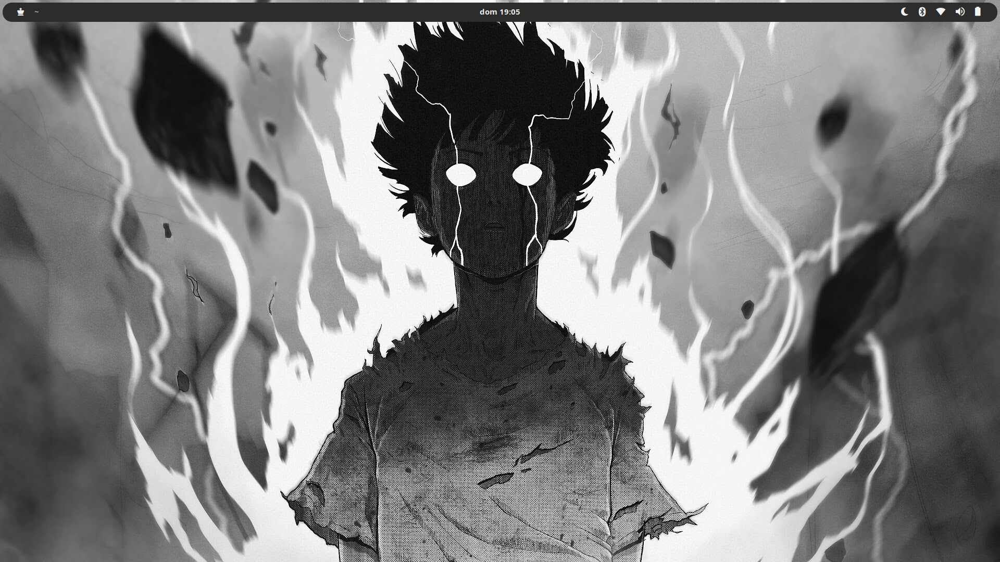
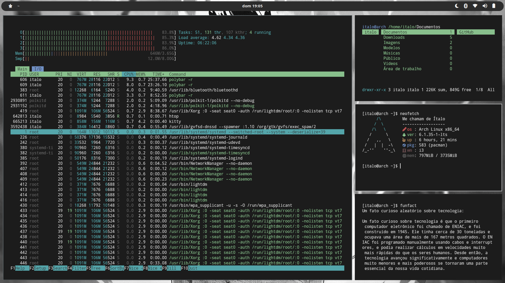
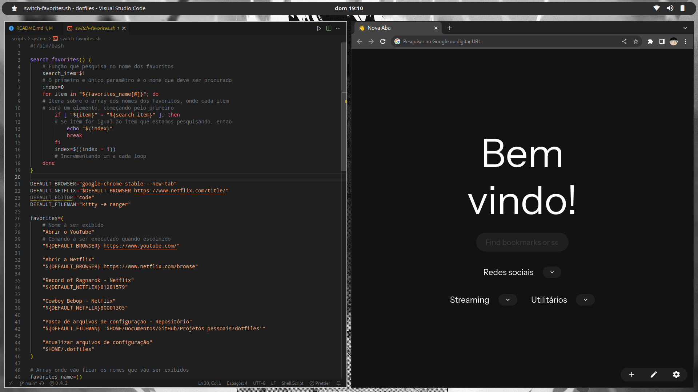

<div align="center">

# Meus Dotfiles

</div>

Este repositório contém minhas configurações pessoais do sistema (dotfiles). Eles incluem arquivos de configuração para várias ferramentas e aplicativos que uso regularmente





## Como usar

Para utilizar meus dotfiles, siga as etapas abaixo:

1. Clone este repositório para o seu computador:

    ```sh
    git clone "<URL do repositório>"
    ```

2. Navegue até o diretório do repositório clonado:

    ```sh
    cd dotfiles
    ```

3. Copie os arquivos de configuração relevantes para seus respectivos diretórios em seu sistema
4. Siga quaisquer instruções adicionais presentes nos arquivos de configuração, se houver

## Arquivos Incluídos

- `.config`: Arquivos de configurações dos meus aplicativos
  - `dunst`: Arquivo de configuração do dunst
  - `fontconfig`: Arquivo de configuração das fontes
  - `i3`: Arquivo de configuração do meu i3wm
  - `kitty`: Arquivo de configuração do emulador de terminal kitty
  - `picom`: Arquivo de configuração do compositor de janelas picom
  - `polybar`: Arquivo de configuração da polybar
  - `ranger`: Arquivo de configuração do gerenciador de arquivos ranger
  - `rofi`: Arquivo de configuração do lançador de aplicativos rofi
- `.scripts`: Scripts em ShellScript personalizados que utilizo
  - `info`: Arquivos de scripts de informações adicionais
  - `system`: Arquivos de scripts relacionados ao sistema
- `.bashrc`: Configurações para o Shell Bash

## Sofwares que utilizo

- **Dunst**: Um notificador de desktop altamente personalizável para sistemas Linux
- **Kitty**: Um emulador de terminal de código aberto e altamente configurável, com suporte a renderização de texto e imagens
- **Picom**: Um compositor de janelas leve e rápido, que adiciona efeitos de transparência e sombras nas janelas do sistema
- **Polybar**: Uma barra de status altamente personalizável para ambientes de desktop, exibindo informações como data/hora, uso de CPU, notificações, entre outros
- **Ranger**: Um gerenciador de arquivos em modo texto para o terminal, com uma interface intuitiva e recursos avançados, como visualização de arquivos e navegação rápida
- **Rofi**: Um seletor de aplicativos e janelas, que permite alternar entre aplicativos abertos e lançar programas de forma rápida
- **htop**: Uma ferramenta de monitoramento de sistema interativa para o terminal, exibindo informações sobre o uso de recursos, como CPU, memória e processos em execução
- **Visual Studio Code**: Um poderoso editor de código-fonte desenvolvido pela Microsoft, com suporte a várias linguagens de programação, depuração e integração com controle de versão
- **GIMP**: Um editor de imagens gratuito e de código aberto, que oferece uma ampla gama de recursos para edição, retoque e criação de imagens
- **Google Chrome**: Um navegador da web desenvolvido pelo Google, conhecido por sua velocidade, segurança e suporte a extensões
- **Vim**: Um editor de texto altamente configurável e poderoso, disponível em vários sistemas operacionais, com uma grande comunidade de usuários e suporte a plug-ins
- **pactl**: Uma ferramenta de linha de comando para controlar o servidor de som PulseAudio no Linux, permitindo o gerenciamento de dispositivos de áudio e ajuste de configurações
- **brightnessctl**: Uma ferramenta de linha de comando para ajustar o brilho da tela em sistemas Linux
- **maim**: Uma ferramenta de captura de tela para o Linux, que permite capturar imagens de tela inteira, áreas específicas ou janelas individuais
- **xclip**: Uma ferramenta de linha de comando para manipulação de área de transferência, permitindo copiar e colar texto e conteúdo entre diferentes aplicativos
- **xdotool**: Uma ferramenta de automação de tarefas no Linux, que permite simular eventos do mouse e do teclado, além de manipular janelas e interagir com aplicativos
- **feh**: Um visualizador de imagens leve e rápido para sistemas Linux, com suporte a exibição de imagens individuais ou como um slideshow
- **playerctl**: Uma ferramenta de linha de comando para controlar reprodutores de mídia no Linux, permitindo pausar, reproduzir, avançar e retroceder faixas de áudio
- **neofetch**: Uma ferramenta de linha de comando para exibir informações do sistema e detalhes da distribuição Linux em uma forma artística no terminal
- **bluez** e **bluez-utils** : Uma implementação do protocolo Bluetooth para sistemas Linux, fornecendo recursos de comunicação sem fio Bluetooth e um conjunto de utilitários para o sistema BlueZ, permitindo a configuração e gerenciamento de dispositivos Bluetooth no Linux

## Wallpapers

Os wallpapers incluídos neste repositório são usados para personalizar a aparência do sistema, e gostaria de destacar que alguns dos wallpapers utilizados não possui informações claras sobre a licença e o autor. Eu fiz uma busca, mas não consegui encontrar informações

Caso você seja o autor desse wallpaper ou tenha informações sobre a licença, por favor, entre em contato para que eu possa atribuir corretamente os créditos

## Tema e ícones

- **Tema: [Orchis](https://github.com/vinceliuice/Orchis-theme) (Variação de cor: Gray)**
  - O Orhis é um tema popular que apresenta uma aparência moderna e limpa em sistemas operacionais Linux. A variação de cor Gray do tema oferece uma paleta de cores suaves e elegantes, que combinam bem com a maioria das interfaces gráficas de usuário
- **Ícones: [Papyrus](https://github.com/PapirusDevelopmentTeam/papirus-icon-theme)**
  - os ícones Papyrus são conhecidos por sua aparência nítida e detalhada, o que os torna ideais para uso em telas de alta resolução. Eles também têm uma grande variedade de ícones disponíveis, cobrindo muitas categorias diferentes de aplicativos e pastas

## Contribuição

Sinta-se à vontade para explorar, utilizar e adaptar meus dotfiles de acordo com suas necessidades. Se você encontrar algum problema ou tiver sugestões de melhoria, fique à vontade para abrir uma issue ou enviar uma solicitação de pull

## Licença

Este projeto é licenciado sob a [Licença MIT](https://github.com/itaaloluz/dotfiles/blob/master/LICENSE). Veja o arquivo `LICENSE` para obter mais detalhes

> **Aviso:** Tenha cuidado ao utilizar essas configurações em seu sistema. É recomendado que você faça backup de seus arquivos de configuração existentes antes de substituí-los pelos fornecidos neste repositório
